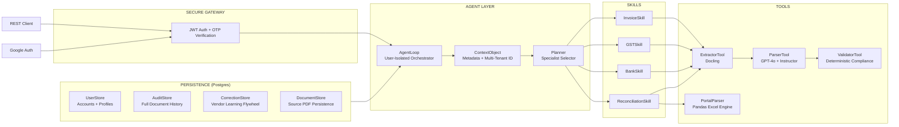

<div align="center">


<br/>

[](https://python.org)
[](https://fastapi.tiangolo.com)
[](https://openai.com)
[](https://github.com/DS4SD/docling)
[](https://github.com/jxnl/instructor)
[](LICENSE)

<br/>

> **Upload a PDF invoice, GST return, bank statement, or TDS certificate.**
> **Taxyn extracts structured data, validates Indian compliance rules, and reconciles against portal data — automatically.**

<br/>

</div>

---

## What It Does

Taxyn is an AI-powered platform that automates Indian financial document audits:

1. **Secure Identity:** Email verification (OTP) and Google Auth ensure data isolation per user.
2. **Deep Extraction:** Pulls multi-line tables from PDFs using IBM Docling (30x faster than traditional OCR).
3. **Smart Reconciliation:** Matches physical invoices against actual Government GSTR-2A portal Excel files to find missing tax credits.
4. **Deterministic Audit:** Hardcoded validation for GSTIN, PAN, and tax math to eliminate AI hallucinations.
5. **Continuous Learning:** Remembers every human correction, improving vendor-specific accuracy over time.

---

## Architecture



---

## Quick Start

```bash
# 1. Clone & Setup
git clone https://github.com/tanishra/taxyn.git
cd taxyn
pip install -r requirements.txt

# 2. Configure Environment
# Add DATABASE_URL, OPENAI_API_KEY, and SMTP settings for OTP to .env

# 3. Run Backend
python main.py

# 4. Choose your Interface:

# Option A: Modern SaaS Dashboard (Next.js)
cd frontend
npm install
npm run dev

# Option B: Simple Utility (Streamlit)
streamlit run app.py
```

---

## Key Features

- **GSTR-2A Portal Sync:** Upload actual government Excel files to find missing Input Tax Credit (ITC) instantly.
- **Side-by-Side Verification:** Professional UI to verify AI extractions against the source PDF in real-time.
- **Enterprise Persistence:** All documents, audits, and profiles are stored in high-performance PostgreSQL.
- **Vendor Memory:** System learns from your corrections once and applies them to all future documents from that vendor.
- **SaaS Identity:** Full account management with profile sections for Company Name and GSTIN.

---

## Supported Documents

Taxyn is specialized for the unique layouts of Indian compliance documentation:

- **Invoices:** B2B and B2C invoices with multi-line item table extraction.
- **Bank Statements:** Full ledger processing from all major Indian banks (SBI, HDFC, ICICI, etc.).
- **GST Returns:** Parses GSTR-1, GSTR-3B, and portal summaries for audit.
- **TDS Certificates:** Automated reconciliation of Form 16/16A data.

---

## Roadmap & Contributions

- **Bulk Ingestion:** Background batch processing for thousands of documents.
- **Direct ERP Sync:** One-click data push to Tally Prime and Zoho Books.
- **Risk Scoring:** Automated vendor fraud detection based on GST registration status.
- **Mobile App:** Rapid capture of physical bills via smartphone camera.
- **Contribute:** PRs welcome! Help us make Taxyn better.

---

<div align="center">


</div>
