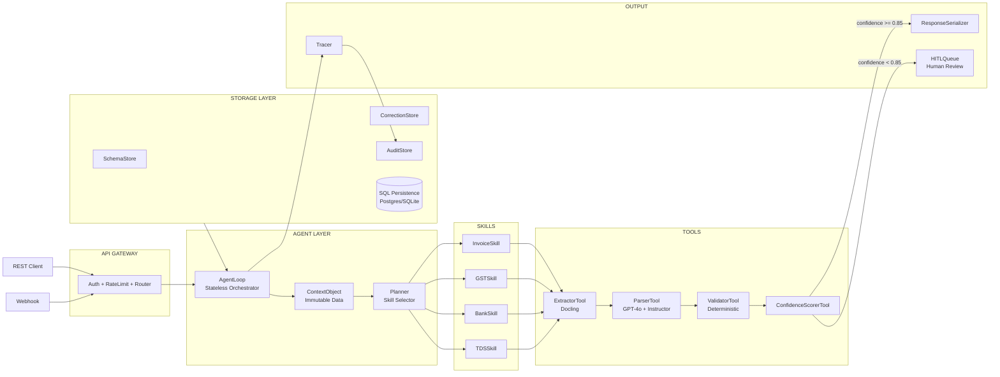

<div align="center">


<br/>

[](https://python.org)
[](https://fastapi.tiangolo.com)
[](https://openai.com)
[](https://github.com/DS4SD/docling)
[](https://github.com/jxnl/instructor)
[](LICENSE)

<br/>

> **Upload a PDF invoice, GST return, bank statement, or TDS certificate.**
> **Taxyn extracts structured data, validates Indian compliance rules, and flags anomalies — automatically.**

<br/>

</div>

---

## What It Does

Taxyn is an AI agent pipeline that processes Indian financial documents end-to-end:

1. **Extracts** raw text from PDF using Docling (tables preserved, 30x faster than OCR)
2. **Parses** structured fields using LLM + Instructor (typed Pydantic output, no JSON errors)
3. **Validates** Indian compliance rules deterministically — GST rates, GSTIN format, PAN format, date checks
4. **Scores** confidence per field — below 85% threshold → routed to human review
5. **Returns** clean structured JSON or queues for HITL review

---

## Architecture



---

## Quick Start

```bash
# 1. Install dependencies
pip install -r requirements.txt

# 2. Configure environment
cp .env.example .env
# Add your OPENAI_API_KEY and DATABASE_URL (optional)

# 3. Run Backend
python main.py

# 4. Run Frontend
cd frontend
npm install
npm run dev
```

---

## Key Features

- **Deterministic Validation:** 100% code-based verification for GSTIN, PAN, and Indian Tax rates. No AI "hallucinations."
- **Side-by-Side Correction:** Professional human review interface with source PDF and editable fields for low-confidence data.
- **Resilient Storage:** Cascading fallback system (PostgreSQL → SQLite → In-Memory) ensuring 100% uptime.
- **Data Flywheel:** Learns from every human correction, improving vendor-specific accuracy over time.
- **Table Preservation:** Powered by IBM Docling to ensure complex financial tables are extracted perfectly.

---

## Supported Documents

Taxyn is pre-configured to understand the specific layouts of Indian financial documents:

- **Invoices:** Handles B2B and B2C invoices with multi-line item extraction.
- **GST Returns:** Parses GSTR-1, GSTR-3B, and GSTR-2A/2B summaries.
- **Bank Statements:** Processes PDF ledgers from all major Indian banks.
- **TDS Certificates:** Extracts Form 16/16A data for tax reconciliation.

---

## Roadmap & Contributions

- **Smart Features:** Building auto-matching for GST data and fraud detection.
- **Easy Sync:** Connecting Taxyn directly to WhatsApp, Tally, and Zoho.
- **Wider Reach:** Adding support for regional languages and a mobile app.
- **Contribute:** PRs welcome! Help us make Taxyn better.

---

<div align="center">


</div>
