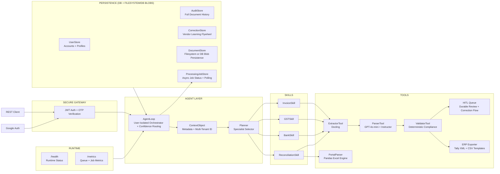

<div align="center">


<br/>

[](https://python.org)
[](https://fastapi.tiangolo.com)
[](https://openai.com)
[](https://github.com/DS4SD/docling)
[](https://github.com/jxnl/instructor)
[](LICENSE)

<br/>

> **Upload a PDF invoice, GST return, bank statement, TDS certificate, or reconciliation document.**
> **Taxyn extracts structured data, validates Indian compliance rules, and reconciles against portal data automatically.**

<br/>

</div>

---

## What It Does

Taxyn is an AI-powered platform that automates Indian financial document audits:

1. **Secure Identity:** Email verification (OTP), Google Auth, tenant-scoped document access, and app-level rate limiting protect user workflows.
2. **Deep Extraction:** Pulls multi-line tables from PDFs using IBM Docling with schema-driven extraction per document type.
3. **Smart Reconciliation:** Matches source documents against Government GSTR-2A portal Excel files with deterministic normalization and mismatch review signals.
4. **Deterministic Audit:** Hardcoded validation for GSTIN, PAN, TAN, IFSC, date integrity, tax math, and bank balance consistency to eliminate AI hallucinations.
5. **Continuous Learning:** Remembers every human correction, improving vendor-specific accuracy over time.
6. **Background Processing:** Supports async document jobs with polling so large uploads do not have to block a single request.
7. **Operational Visibility:** Exposes `/health` and `/metrics` endpoints for runtime status, queue depth, and job tracking.
8. **ERP-Ready Exports:** Generates Tally XML plus Zoho and QuickBooks CSV exports directly from verified invoice data without requiring external API keys.

---

## Architecture



---

## Quick Start

```bash
# 1. Clone & Setup
git clone https://github.com/tanishra/taxyn.git
cd taxyn
pip install -r requirements.txt

# 2. Configure Environment
cp .env.example .env
# Update .env with DATABASE_URL (Neon Postgres recommended), OPENAI_API_KEY,
# HUGGINGFACE_TOKEN, SMTP settings, SUPPORT_EMAIL, GOOGLE_CLIENT_ID,
# CORS_ORIGINS, DOCUMENT_STORAGE_MODE, DOCUMENT_STORAGE_PATH, and ENABLE_ASYNC_PROCESSING

# 2b. Create the local document storage directory if using filesystem mode
mkdir -p data/documents

# 3. Run Backend
python main.py

# 4. Choose your Interface:

# Option A: Modern SaaS Dashboard (Next.js)
cd frontend
npm install
npm run dev

# Option B: Simple Utility (Streamlit)
streamlit run app.py

# 5. Runtime Checks
# Health:   http://localhost:8000/health
# Metrics:  http://localhost:8000/metrics

# 6. Try Invoice ERP Export
# Process an invoice, then use the UI buttons to download:
# - Tally XML
# - Zoho CSV
# - QuickBooks CSV
```

---

## Key Features

- **GSTR-2A Portal Sync:** Upload actual government Excel files to find missing Input Tax Credit (ITC) instantly.
- **Async Processing + Polling:** Queue long-running uploads and poll status instead of blocking a single HTTP request.
- **Side-by-Side Verification:** Professional UI to verify AI extractions against the source PDF in real-time.
- **Flexible Persistence:** Store document binaries on the local filesystem for single-server deployments or in the database, while keeping jobs, audits, and profiles in persistent storage.
- **Metrics Endpoint:** Track runtime health, pending reviews, active jobs, completed jobs, and failed jobs through `/metrics`.
- **ERP Export:** Download verified invoice data as Tally XML or import-ready Zoho and QuickBooks CSV files without API integration.
- **Vendor Memory:** System learns from your corrections once and applies them to all future documents from that vendor.

---

## Supported Documents

Taxyn is specialized for the unique layouts of Indian compliance documentation:

- **Invoices:** B2B and B2C invoices with multi-line item table extraction, optional QR authenticity checks, and ERP-ready export output.
- **Bank Statements:** Full ledger processing with transaction extraction plus IFSC and balance consistency checks.
- **GST Returns & Reconciliation:** Parses GSTR summaries and supports portal Excel-assisted reconciliation workflows with partial-match review states.
- **TDS Certificates:** Extracts and validates core Form 16/16A identifiers including PAN and TAN.

---

## Roadmap & Contributions

- **Bulk Ingestion:** Extend the current async single-server job model into a distributed worker architecture for high-volume processing.
- **Direct ERP Sync:** Extend the current file-based Tally XML and CSV exports into one-click connected integrations with Tally Prime and Zoho Books.
- **Risk Scoring:** Automated vendor fraud detection based on GST registration status.
- **Mobile App:** Rapid capture of physical bills via smartphone camera.
- **Contribute:** PRs welcome! Help us make Taxyn better.

---

<div align="center">


</div>
